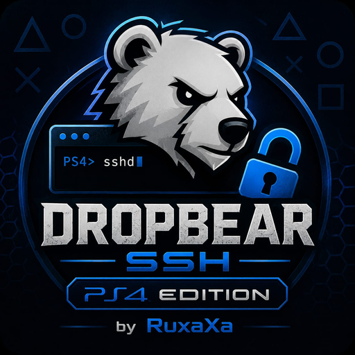

  

# Dropbear SSH — PS4 Edition

Reboot-tested experimental Dropbear SSH port for an owner-operated PlayStation 4.

## Download

The compiled v1.07 / Build 57 PKG is published as a versioned GitHub Release asset rather than committed to Git:

**[Download the latest release](https://github.com/RuxaXa/ps4-dropbear-ssh/releases/latest)**

Expected package:

- file: `IV0000-BREW00010_00-DROPBEARSSH00000.pkg`
- size: `6619136` bytes
- SHA-256: `a711007389a011d8d6d2b01e075e01767fe9dc47981ede26b04aa9ee749392f6`
- title ID: `BREW00010`
- application version: `1.07`

Verify the hash before installation.

## Critical security warning

This is historical research software, **not a hardened internet SSH service**. Build 57:

- enables password authentication;
- accepts the compatibility credential `root` / `root`;
- listens on `0.0.0.0:2222`;
- uses serial `DEBUG_NOFORK` session handling;
- was configured with `--disable-harden`.

Use only on an isolated trusted LAN/VLAN behind firewall policy. Never expose TCP 2222 to the internet. Prefer public-key authentication and treat a key-only successor as a separate build requiring fresh target validation.

## Package lifecycle

1. Install the PKG with an authorized PS4 homebrew package installer.
2. First tile launch runs the installer, stages the daemon under `/system/vsh/app/BREW00010`, displays a notification and returns toward the home screen.
3. Close the application if it remains mapped.
4. A later fresh tile launch starts the installed Dropbear daemon.
5. Connect to TCP port `2222` using a complete SSH client; do not occupy the serial listener with a raw banner probe.

The installer modifies the console system application area and therefore requires an already authorized/jailbroken environment. Do not install on a console you do not own or administer.

## Proven behavior

Historical live testing on PS4 system software 9.00 confirmed:

- public-key login as the synthetic `root` account;
- serial no-fork sessions;
- non-PTY commands and virtual PTY research shell;
- legacy SCP upload handling;
- byte-exact downloads up to 8192 bytes and controlled rejection above that bound;
- package installation and two reboot smoke tests.

Not proven: SFTP, forwarding, parallel sessions, downloads above 8 KiB, other firmware versions or internet-safe operation.

## Source layout

- [`dropbear/`](dropbear/) — complete Dropbear `2026.91` source plus PS4 port
- [`packaging/installer-v107/`](packaging/installer-v107/) — GPLv3 installer/package recipe and logo
- [`third_party/openorbis-v0.5.4-modules/`](third_party/openorbis-v0.5.4-modules/) — source and GPL notice for the two embedded runtime PRX modules
- [`provenance/dropbear-build57/`](provenance/dropbear-build57/) — upstream, build and artifact identities
- [`RELEASE-v1.07.md`](RELEASE-v1.07.md) — release notes and package content hashes
- [`SECURITY.md`](SECURITY.md) — mandatory deployment boundaries
- [`BUILD_PS4.md`](dropbear/BUILD_PS4.md) — source build instructions

## Separate research project

PS4 firmware, exFAT, PUP and SAMU research is maintained separately:

https://github.com/RuxaXa/ps4-research

## Licensing

This repository is multi-license. Dropbear and bundled libraries retain their upstream permissive licenses. The installer and OpenOrbis components are GPLv3. The RuxaXa logo is not relicensed as software. See [`LICENSING.md`](LICENSING.md).
